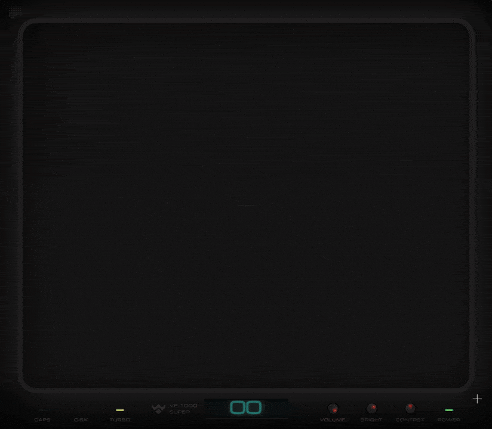

# Ownedge | Independent by Design



> **A digital window for independent creators and builders.**
> *Defying the establishment. Crafted with precision.*

---

## 🎨 Aesthetic & Design Philosophy

Ownedge is a love letter to **retro-futurism**, blending the raw utility of 90s tracker interfaces with the sleek, high-fidelity visuals of modern web design.

### Key Visual Elements
*   **CRT Simulation**: A multi-layered visual stack including scanlines, phosphor persistence, and curvature distortion to simulate a high-quality CRT monitor.
*   **VFD (Vacuum Fluorescent Display)**: Typography and color palettes (Teals/cyans against deep blacks) mimic the luminous glow of vintage VFD equipment.
*   **Isometric Architecture**: UI elements like the "Speaker" and "Keyboard" indicators use isometric projection to ground the digital interface in a physical spatial context.
*   **Music Tracker Layout**: The main navigation overlay (`TrackerOverlay`) is designed to look like a music tracker (e.g., FastTracker II, Impulse Tracker), symbolizing the raw creation of art through code.

---

## 🏗️ Technical Architecture

Built on **Vue 3** and **Vite**, the application is architected for high performance despite the heavy visual load.

### Core Systems

#### 1. Audio Engine (`SoundManager`)
The application features a custom audio subsystem capable of real-time sound synthesis and interaction.
*   **WASM Backend**: Heavy pattern processing for the tracker lines is offloaded to a WebAssembly module to ensure the main thread remains free for UI rendering.
*   **Visualization**: The `BootLoader` component taps directly into the audio frequency data to drive the real-time spectrum analyzer on the "VFD" screen.

#### 2. Visual System
*   **`BootLoader.vue`**: A complex state machine managing the startup sequence (BIOS -> Memory Test -> Kernel Load -> Connection). It uses efficient DOM updates to simulate a high-speed terminal interface.
*   **`TrackerOverlay.vue`**: optimized canvas renderer.
    *   **Optimization**: Implements a `rowCache` map to minimize calls to the WASM backend.
    *   **Rendering**: Uses pre-calculated gradients for fade effects to avoid garbage collection overhead during the render loop.
    *   **Compositing**: Consolidates canvas draw calls to minimize state changes.

#### 3. Backend & Legacy Hacks (PHP)
*   **Guestbook & Chat**: Powered by simple PHP scripts (`guestbook.php`, `chat.php`) located in the `/public` directory.
*   **The Hack**: Why PHP in 2026? To leverage **legacy free WordPress hosting** providers. By dropping these simple scripts into a standard LAMP stack environment, we get persistent storage (JSON/txt files) and dynamic functionality without paying for a VPS or cloud functions. It's a pragmatic nod to the "old web".

#### 4. SEO & Structured Data
*   **Video Indexing**: Background video assets are served from stable public URLs (`/ownedge.mp4`) with full `VideoObject` Schema.org markup injected into the head, ensuring rich results in search engines.

---

## 🛠️ Development

### Prerequisites
*   Node.js 18+
*   npm

### Setup
```bash
npm install
```

### Run Locally
Start the high-performance Vite development server:
```bash
npm run dev
```

### Build for Production
Generates the static bundle and handles static route generation:
```bash
npm run build
```

---

## 📂 Project Structure

*   `src/components`: UI components (BootLoader, TrackerOverlay, etc.)
*   `src/sfx`: specialized sound management logic.
*   `src/assets`: Compiled assets.
*   `public/`: Static assets (Videos, Favicons) served at root.
